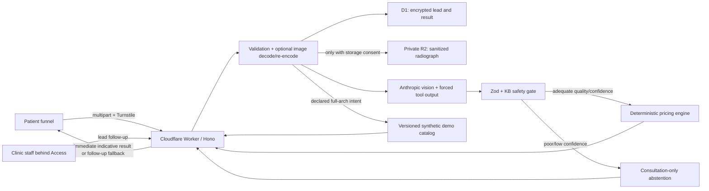
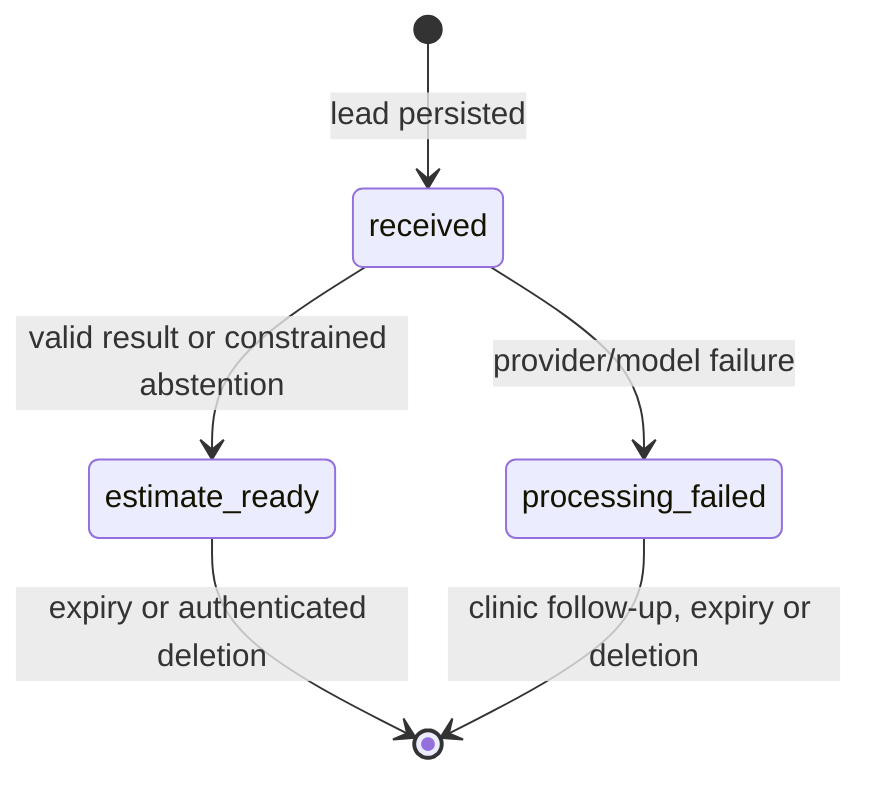

# Architecture

## Product boundary

Quotengine is not a trained dental model. It is a guarded orchestration and deterministic-pricing
system around an external multimodal model. The Worker owns validation, consent, abuse controls,
data lifecycle, output constraints and lead delivery; Anthropic is used only for the bounded
image-to-structured-assessment step.



## Request sequence

```mermaid
sequenceDiagram
  actor Patient
  participant API as Worker
  participant DB as D1
  participant Store as R2
  participant AI as Anthropic

  Patient->>API: POST /api/leads + Idempotency-Key
  API->>API: Origin, staging gate and source-IP rate limit
  API->>API: Turnstile verification
  API->>API: Consent hashes and multipart validation
  API->>API: Validate optional image; decode and canonicalize when present
  API->>API: Fingerprint normalized form, consent context and image
  API->>DB: Idempotency lookup (return only an exact retry)
  API->>API: Phone and email rate limits
  opt Optional storage consent
    API->>Store: Put sanitized radiograph
  end
  API->>DB: Insert encrypted lead (received)
  alt Patient selected full-arch scenario
    API->>API: Resolve versioned per-arch range; no AI call
    API->>DB: estimate_ready + encrypted commercial result
    API-->>Patient: 201 + immediate demo range
  else Vision-item path
    API->>AI: Image + intent/message + KB-constrained tool
  alt Valid structured assessment
    AI-->>API: DentalAssessment
    API->>API: Safety gate and deterministic price calculation
    API->>DB: estimate_ready + encrypted result
    API-->>Patient: 201 + immediate indicative result
  else Model/provider failure
    API->>DB: processing_failed
    API-->>Patient: 201 + follow_up_required
  end
  end
```

The lead is persisted before inference, so a provider failure does not discard the commercial
contact. The inference remains inline because a long vision request is not guaranteed to complete
inside Workers' post-response `waitUntil()` window. A browser retry reuses its idempotency key and
recovers the same encrypted access token without a second inference only when the normalized form,
consent context and any processed canonical-image fingerprint match; conflicting reuse returns
`409`. A file deliberately ignored by the no-image full-arch path is not part of that fingerprint. Moving
inference to a durable background job remains the next reliability milestone for stronger crash
recovery.

## Trust boundaries and data

| Data | Storage / processor | Protection | Retention |
|---|---|---|---|
| Name, phone, email, message, UTM attribution | D1 | AES-256-GCM application encryption | Configured, currently 30 days |
| Structured assessment and estimate | D1 | Same encrypted payload | Same lead retention |
| Sanitized radiograph | R2, only with separate consent | Private binding, random key, EU jurisdiction | App deletion + lifecycle backstop |
| Image used for inference | Worker memory and Anthropic API, vision paths only | No application persistence when storage is refused | Provider contract/retention controls apply |
| Access/deletion audit | D1 | Metadata only; opaque lead reference | Separate audit retention |

Image canonicalization strips ordinary file metadata and trailing payloads. It cannot remove a name
or identifier burned into image pixels. D1/R2 EU jurisdiction also does not make the Anthropic API
transfer EU-only.

## Lead state machine



`estimate_ready` does not mean clinically approved. It means a patient-facing, constrained and non-binding result is
available. `consultationOnly=true` is a successful abstention with no numerical quote. Every
numerical result carries `requiresInPersonConfirmation=true`.

The response contains a bounded implant-count range only when implants are present. Other accepted
treatments retain the deterministic point total and return `priceRange=null`.

Automatic item-level implant pricing is capped at three fixtures. Four or more ordinary implant
lines can represent full-arch work, whose prosthesis, connections and provisional components are
absent from the clinical item catalog; those model candidates still abstain. Separately, a patient
who explicitly selects the full-arch goal receives a deterministic scenario from the synthetic
demo catalog: EUR 2,700–4,000 per selected arch. That branch does not run vision
inference, assert eligibility or add fixture lines. The uncertainty range is capped at the same
three-fixture boundary and can never reintroduce a four-fixture item price.

## Reproducibility

Each lead records the configured model plus pipeline, prompt, tool-schema and price-KB versions.
Commercial-scenario leads record `not_used` for the model/prompt/tool and the commercial catalog
version in the KB-version field.
The model selects only IDs present in the KB; Zod and KB validation reject malformed or invented
items; every candidate must carry an arch and the deterministic gate removes candidates outside the
patient-declared scope. The model never performs price arithmetic. Version constants live in
`src/dental/modelMetadata.ts` and must be bumped with their corresponding artifact.
